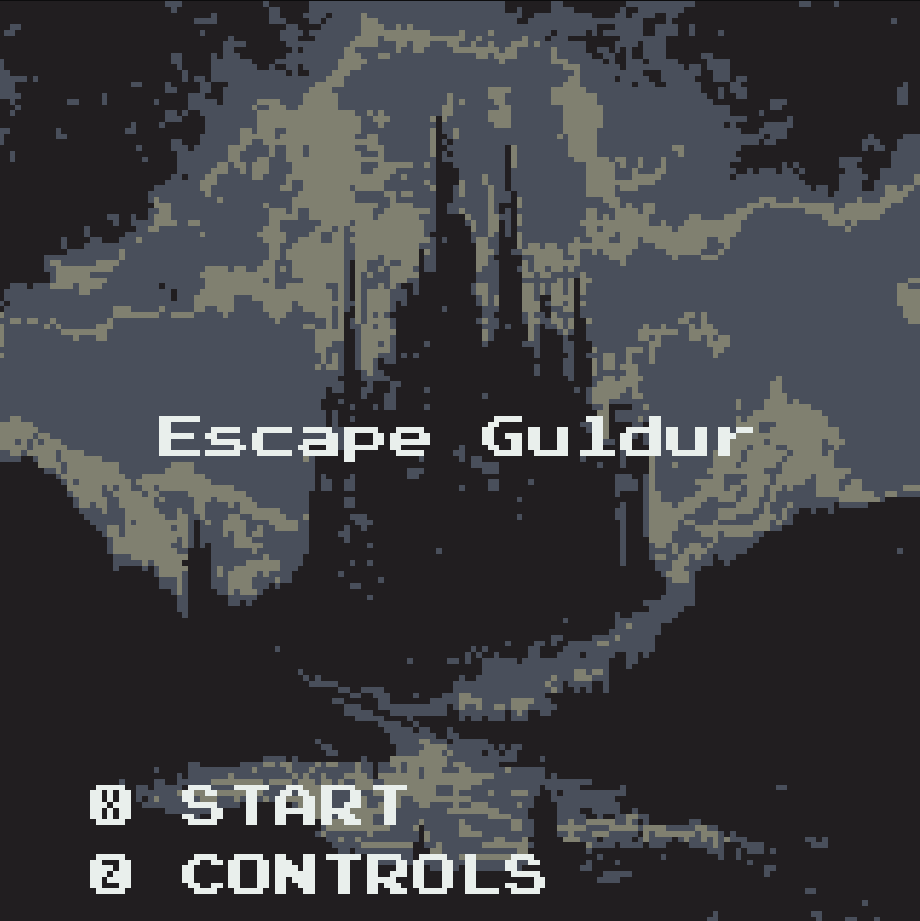

# Escape Guldur

A retro action-RPG written in [Zig](https://ziglang.org/) for the [WASM-4 fantasy console](https://wasm4.org/). Originally made for [WASM-4 Jam #2](https://itch.io/jam/wasm4-v2).




## Building

#### Requirements
- [Zig 0.9.1](https://github.com/ziglang/zig/releases/tag/0.9.1)
- [WASM-4](https://wasm4.org/docs/getting-started/setup)
- [wasm-opt](https://www.npmjs.com/package/wasm-opt)

Build and run all tests with:
```shell
zig build test
```

Build (debug) the cart (zig-out/lib/cart.wasm) by running:

```shell
zig build
```

then run it with:

```shell
w4 watch zig-out/lib/cart.wasm
```

Produce a size-optimised release build (zig-out/lib/opt.wasm) by running:

```shell
zig build -Drelease-small=true release
```

and remember to test it with:

```shell
w4 run zig-out/lib/opt.wasm
```

## Distribution

```shell
cp zig-out/lib.opt.wasm game.wasm
wapm login
wapm publish
w4 bundle game.wasm --title "Escape Guldur" --html escape_guldur.html
```
